# Remediation Automation

Automated security-vulnerability remediation orchestration powered by the
[Devin API](https://docs.devin.ai). The system scans a codebase with SCA and
SAST tools, files findings as GitHub issues, dispatches autonomous Devin
sessions to remediate each finding, and tracks results in a live dashboard.

**Target repository:** [michaelszhu/superset](https://github.com/michaelszhu/superset)
(a fork of Apache Superset)

---

## How to Simulate the Workflow (5 minutes)

The entire system can be run locally with **Docker** in **replay mode** --
no Devin API key or GitHub token required. Replay mode replays recorded
real-session outputs so you see exactly what a live run produces.

### Prerequisites

- [Docker](https://docs.docker.com/get-docker/) and
  [Docker Compose](https://docs.docker.com/compose/install/) (v2+)
- Python 3.10+ (only needed for the demo script; the services run inside Docker)

### 1. Clone and configure

```bash
git clone https://github.com/michaelszhu/remediation-automation.git
cd remediation-automation
cp .env.example .env
```

Edit `.env` and set:

```
DEVIN_REPLAY=1
```

That is the only change required. All other variables can stay at their
defaults (API keys are not needed in replay mode).

### 2. Start the stack

```bash
docker compose up --build -d
```

This launches two services:

| Service        | URL                    | Description                        |
|----------------|------------------------|------------------------------------|
| Orchestrator   | http://localhost:8000  | FastAPI service -- dispatches and tracks Devin sessions |
| Dashboard      | http://localhost:8001  | Read-only status UI with auto-refresh |

### 3. Run the demo

Install the script's one dependency and run the demo:

```bash
pip install requests
python -m scripts.run_demo demo --pace 3
```

The demo script:

1. **Simulates scanner output** -- prints the three findings to the terminal
2. **Sends webhook events** to the orchestrator (one per finding, paced 3 seconds apart)
3. **Shows Devin's decisions** in the terminal as each session completes
4. **Prints a final tally** and links to the dashboard

Open **http://localhost:8001** in your browser to watch the dashboard populate
in real time as each finding is dispatched and resolved.

### 4. Run the automated verification suite (optional)

```bash
python -m scripts.run_demo verify
```

This runs four correctness gates against the replay stack and prints
`ALL 4 GATES PASSED` on success:

| Gate | What it checks |
|------|---------------|
| 1 -- Stack Up | Orchestrator and dashboard are reachable |
| 2 -- Dispatch + Classify | 3 findings dispatched, correct per-finding outcomes, dashboard aggregates |
| 3 -- Webhook Path | `issues.labeled` webhook creates one session per finding |
| 4 -- Idempotency + Reset | Duplicate webhook does not create duplicate sessions; reset clears state |

### 5. Tear down

```bash
docker compose down -v
```

---

## Demo Findings

The system ships with three recorded findings from real Devin sessions:

| Finding | Type | Devin's Decision | Outcome |
|---------|------|-----------------|---------|
| **paramiko** -- `paramiko==3.5.1` dependency risk (sshtunnel relies on removed DSSKey) | SCA | **False positive** | Devin analyzed the codebase: paramiko 3.5.1 with `<4.0` upper bound prevents the DSSKey breakage. No code change needed. Posted analysis as issue comment. |
| **PyJWT** -- `CVE-2022-29217` algorithm confusion in `PyJWT==2.12.0` | SCA | **False positive** | Devin investigated all `jwt.decode()` call sites: all pass explicit `algorithms` arguments, and the installed version (2.12.0) is well above the fix threshold (2.4.0). No code change needed. |
| **hive-column-injection** -- unsanitized partition column names in `HiveEngineSpec.where_latest_partition()` | SAST | **Fixed** | Devin added `SAFE_IDENTIFIER_REGEX` validation in both Hive and Presto engine specs. Opened [PR #53](https://github.com/michaelszhu/superset/pull/53) with tests. |

---

## Architecture

```mermaid
flowchart LR
    subgraph Scanners
        SCA[SCA Scanner<br/>pip-audit]
        SAST[SAST Scanner<br/>Semgrep]
    end

    subgraph This Repo
        Shared[shared/<br/>models &#183; db &#183; devin client]
        Orch[orchestrator/<br/>FastAPI dispatcher]
        Dash[dashboard/<br/>status UI]
        DB[(SQLite)]
    end

    subgraph Devin
        API[Devin v3 API]
        Session[Devin Session]
    end

    SCA --> Orch
    SAST --> Orch
    Orch -->|create_session| API
    API --> Session
    Session -->|structured_output| Orch
    Orch --> DB
    Shared --- Orch
    Shared --- Dash
    Dash --> DB
```



### How It Works

1. **Scanners** (`scanners/`) run `pip-audit` (SCA) and Semgrep (SAST)
   against the target repository. Each vulnerability is normalized into a
   `Finding` object and filed as a labelled GitHub issue (`devin-remediate`).

2. **Orchestrator** (`orchestrator/`) receives findings -- either via the
   `/run-batch` endpoint or an `issues.labeled` webhook. For each finding it
   creates a Devin session via the v3 API, passing a structured-output schema
   that forces Devin to return a machine-readable remediation report (action
   taken, files changed, PR URL, reasoning, etc.).

3. **Dashboard** (`dashboard/`) reads the shared SQLite database and renders
   a live-updating status page showing per-finding outcomes, PR links, ACU
   consumption, and aggregate metrics.

### Record / Replay

The Devin client supports a **record/replay** pattern:

- **Record** (`DEVIN_REPLAY=0 DEVIN_RECORD=1`): Run real Devin sessions and
  capture each session's terminal payload to `recordings/<identifier>.json`.
- **Replay** (`DEVIN_REPLAY=1`): Replay the recorded payloads. No API calls
  are made. If a recording is missing, built-in default recordings are used.

This means the system works out of the box before any real run has been
recorded, and after a real run the demo is indistinguishable from a live
session.

---

## Repository Layout

```
shared/            # Data models, DB helpers, Devin API client
  models.py        # Finding, SessionRecord, structured-output JSON Schema
  db.py            # SQLite init + CRUD
  devin.py         # DevinClient (v3 API), ReplayDevinClient, factory
  config.py        # Env-var config helpers

orchestrator/      # FastAPI service -- dispatches & tracks sessions
  main.py          # /healthz, /webhook, /run-batch, /reset, /seed-demo, /sessions
  dispatch.py      # Prompt builder, session lifecycle, idempotency, recording

dashboard/         # Read-only status dashboard
  main.py          # HTML dashboard + /api/data JSON endpoint

scanners/          # Finding ingesters
  run_sca.py       # pip-audit SCA scanner
  run_sast.py      # Semgrep SAST scanner
  issue_filer.py   # Idempotent GitHub issue creator
  seed_demo_findings.py  # Deterministic 3-finding demo seeder

scripts/           # Validation & demo tooling
  run_demo.py      # Three-mode script: verify / record / demo
  fixtures.py      # GitHub issues.labeled webhook payload fixtures

recordings/        # Recorded real Devin session payloads (replay cache)

docker-compose.yml # Orchestrator + dashboard, shared SQLite volume
Dockerfile
.env.example       # All environment variables (documented)
requirements.txt
```

---

## Running with the Real Devin API

To run against the live Devin API (consumes real ACUs):

```bash
cp .env.example .env
# Edit .env:
#   DEVIN_API_KEY=cog_...      (your service-user Bearer token)
#   DEVIN_ORG_ID=org-...       (your organization ID)
#   DEVIN_REPLAY=0
#   DEVIN_RECORD=1             (optional -- record session outputs)
#   GITHUB_TOKEN=ghp_...       (optional -- file issues on the fork)

docker compose up --build -d
python -m scripts.run_demo record --yes
```

This creates real Devin sessions for each finding, waits for them to
complete, and saves the outputs to `recordings/`. Subsequent runs with
`DEVIN_REPLAY=1` will replay these recorded sessions.

---

## Environment Variables

| Variable             | Required | Default                  | Description                        |
|----------------------|----------|--------------------------|-------------------------------------|
| `DEVIN_API_KEY`      | Yes*     | --                       | Service-user Bearer token           |
| `DEVIN_ORG_ID`       | Yes*     | --                       | Organization ID (`org-...`)         |
| `DEVIN_REPLAY`       | No       | `0`                      | `1` = replay mode (no API needed)   |
| `DEVIN_RECORD`       | No       | `0`                      | `1` = record real session outputs   |
| `DEVIN_RECORDINGS_DIR`| No      | `recordings`             | Directory for recorded payloads     |
| `PLAYBOOK_ID`        | No       | --                       | Devin playbook for sessions         |
| `MAX_CONCURRENCY`    | No       | `3`                      | Max parallel Devin sessions         |
| `MAX_ACU_LIMIT`      | No       | `10`                     | ACU budget per session              |
| `GITHUB_TOKEN`       | No       | --                       | PAT for GitHub API access           |
| `SUPERSET_FORK_REPO` | No       | `michaelszhu/superset`   | Target repo for remediation         |
| `REMEDIATION_DB_PATH`| No       | `remediation.db`         | SQLite database file path           |

*Not required when `DEVIN_REPLAY=1`.

---

## Running Scanners (Optional)

The scanners are only needed to discover new findings against a local clone
of the target repository.

```bash
# Clone the target repo
git clone https://github.com/michaelszhu/superset.git ../superset

# SCA scan (pip-audit)
python -m scanners.run_sca --superset-path ../superset

# SAST scan (Semgrep)
python -m scanners.run_sast --superset-path ../superset

# Add --file-issues to create GitHub issues for each finding
python -m scanners.run_sca --superset-path ../superset --file-issues
```

---

## Related Repository

- **[michaelszhu/superset](https://github.com/michaelszhu/superset)** --
  Forked Apache Superset repository containing the issues selected for
  remediation and the resulting fixes. See `REMEDIATION.md` in that repo for
  details on each issue and its outcome.
