# Remediation Automation

Automated security-vulnerability remediation orchestration powered by the
[Devin API](https://docs.devin.ai). The system ingests findings from SCA and
SAST scanners, dispatches autonomous remediation sessions to Devin, and tracks
results in a central dashboard.

## Architecture

```mermaid
flowchart LR
    subgraph Scanners
        SCA[SCA Scanner<br/>Dependabot / OSV]
        SAST[SAST Scanner<br/>Semgrep / CodeQL]
    end

    subgraph This Repo
        Shared[shared/<br/>models &#183; db &#183; devin client]
        Orch[orchestrator/<br/>FastAPI dispatcher]
        Dash[dashboard/<br/>status UI]
        DB[(SQLite)]
    end

    subgraph Devin
        API[Devin v3 API]
        Session[Devin Session]
    end

    SCA --> Orch
    SAST --> Orch
    Orch -->|create_session| API
    API --> Session
    Session -->|structured_output| Orch
    Orch --> DB
    Shared --- Orch
    Shared --- Dash
    Dash --> DB
```



### Flow

1. **Scanners** produce `Finding` objects (SCA vulnerabilities, SAST rule hits).
2. **Orchestrator** receives findings, creates Devin sessions via the v3 API
   with a structured-output schema, polls until terminal, and persists results.
3. **Dashboard** reads the shared SQLite DB to show remediation status, PRs,
   and risk flags.

## Repository Layout

```
shared/            # The contract — data models, DB helpers, Devin client
  models.py        # Finding, SessionRecord, REMEDIATION_OUTPUT_SCHEMA, tags
  db.py            # SQLite init + CRUD (findings & sessions tables)
  devin.py         # DevinClient (v3 API), ReplayDevinClient, get_devin_client()
  config.py        # Env-var config helpers

orchestrator/      # FastAPI service — dispatches & tracks sessions
  main.py          # /healthz, /webhook, /run-batch, /reset, /seed-demo, /sessions
  dispatch.py      # Prompt builder, session lifecycle, idempotency, recording

dashboard/         # Read-only status dashboard
  main.py          # HTML + /api/data JSON endpoint

scanners/          # Finding ingesters
  run_sca.py       # pip-audit SCA scanner
  run_sast.py      # Semgrep SAST scanner
  issue_filer.py   # Idempotent GitHub issue creator
  seed_demo_findings.py  # Deterministic 3-finding demo seeder

scripts/           # Validation & demo tooling
  run_demo.py      # Three-mode script: verify / record / demo
  fixtures.py      # GitHub issues.labeled webhook payload fixtures

recordings/        # Record/replay cache (written by DEVIN_RECORD=1)

docker-compose.yml # orchestrator + dashboard, shared SQLite volume
Dockerfile
.env.example       # All required environment variables
requirements.txt
```

## Quick Start

### Replay mode (no Devin API key needed)

```bash
cp .env.example .env
# Edit .env — set DEVIN_REPLAY=1
docker compose up --build
```

The `ReplayDevinClient` replays recorded real session payloads from
`recordings/*.json`.  If no recording exists for a finding, it falls back to
built-in default recordings for the eight demo findings:

| Identifier                  | action_taken   | status       | Notes                                      |
|-----------------------------|----------------|--------------|--------------------------------------------|
| `paramiko`                  | declined       | needs_review | Risk: sshtunnel depends on removed DSSKey  |
| `PyJWT`                     | fixed          | success      | CVE-2022-29217; skips unrelated CVEs       |
| `hive-column-injection`     | fixed          | success      | SAST — escaped column identifiers in Hive  |
| `apispec-upgrade`           | fixed          | success      | Bumped apispec, updated test assertion      |
| `dompurify-upgrade`         | fixed          | success      | Bumped DOMPurify for sanitizer-bypass fix   |
| `cancel-query-sql-injection`| false_positive | needs_review | pid interpolation, not user input           |
| `yaml-unsafe-loader`        | fixed          | success      | Replaced yaml.Loader with yaml.SafeLoader   |
| `silenced-exceptions`       | fixed          | success      | Added logging to silenced exception handlers |

### Real mode

```bash
cp .env.example .env
# Edit .env — set real DEVIN_API_KEY, DEVIN_ORG_ID, DEVIN_REPLAY=0
docker compose up --build
```

### Local development (no Docker)

```bash
python -m venv .venv && source .venv/bin/activate
pip install -r requirements.txt
export PYTHONPATH=$PWD
python -c "from shared.db import init_db; init_db()"
```

## Components

### `shared/` (this session)

The shared contract that all other components import. Contains:

- **`models.py`** — `Finding`, `SessionRecord` dataclasses, `FindingType` /
  `ActionTaken` / `RemediationStatus` / `SessionStatus` enums,
  `REMEDIATION_OUTPUT_SCHEMA` (JSON Schema Draft 7), and tag helpers.
- **`db.py`** — SQLite schema init, `upsert_finding`, `upsert_session`,
  `get_session`, `list_sessions`, `list_findings`.
- **`devin.py`** — `DevinClient` (v3 API) with optional recording layer,
  `ReplayDevinClient` (replays recorded real session payloads),
  `get_devin_client()` factory.
- **`config.py`** — Lazy env-var accessors.

### `orchestrator/` (separate session)

FastAPI service that:
- Accepts findings from scanners
- Creates Devin sessions with the remediation playbook
- Polls sessions and persists structured output
- Enforces concurrency and ACU limits

### `dashboard/` (separate session)

Read-only UI showing:
- Finding status overview
- Session details, PRs, risk flags
- ACU consumption

### `scanners/`

Security scanners that produce `Finding` objects from the Superset fork and
optionally file them as labelled GitHub issues.

- **`run_sca.py`** — Runs `pip-audit` against the fork's Python requirements,
  normalizes each vulnerability into a `Finding(finding_type="sca")`.
- **`run_sast.py`** — Runs Semgrep with `p/python` + `p/security-audit`
  rulesets over the fork's `superset/` backend source (excludes `tests/`,
  `migrations/`, `examples/`), normalizes each hit into a
  `Finding(finding_type="sast")`.
- **`issue_filer.py`** — Given a list of `Finding` objects, creates one
  labelled (`devin-remediate`) GitHub issue per finding on the fork.
  Idempotent: a fingerprint comment in the issue body prevents duplicates.
- **`seed_demo_findings.py`** — Creates exactly three deterministic issues
  from known-good findings (see table above) for a reproducible demo.

## Environment Variables

| Variable             | Required | Default                  | Description                              |
|----------------------|----------|--------------------------|------------------------------------------|
| `DEVIN_API_KEY`      | Yes*     | —                        | Service-user Bearer token                |
| `DEVIN_ORG_ID`       | Yes*     | —                        | Organization ID (`org-...`)              |
| `DEVIN_REPLAY`       | No       | `0`                      | Set to `1` for replay mode               |
| `DEVIN_RECORD`       | No       | `0`                      | Set to `1` to record real session outputs |
| `DEVIN_RECORDINGS_DIR`| No      | `recordings`             | Directory for recorded session payloads  |
| `PLAYBOOK_ID`        | No       | —                        | Devin playbook for remediation sessions  |
| `MAX_CONCURRENCY`    | No       | `3`                      | Max parallel Devin sessions              |
| `MAX_ACU_LIMIT`      | No       | `10`                     | ACU budget per session                   |
| `GITHUB_TOKEN`       | No       | —                        | PAT for GitHub API access                |
| `SUPERSET_FORK_REPO` | No       | `michaelszhu/superset`   | Target repo for remediation              |
| `REMEDIATION_DB_PATH`| No       | `remediation.db`         | SQLite database file path                |

*Not required when `DEVIN_REPLAY=1`.

## Running Scanners

### Prerequisites

```bash
pip install -r requirements.txt
export PYTHONPATH=$PWD
```

For live scans you also need the Superset fork cloned locally:

```bash
git clone https://github.com/michaelszhu/superset.git ../superset
```

### Seed the demo backlog (recommended first step)

Creates three known-good issues on the fork — deterministic and idempotent:

```bash
export GITHUB_TOKEN=ghp_...
export SUPERSET_FORK_REPO=michaelszhu/superset
python -m scanners.seed_demo_findings
```

### Live SCA scan (pip-audit)

```bash
python -m scanners.run_sca --superset-path ../superset
# Add --file-issues to create GitHub issues for each finding
python -m scanners.run_sca --superset-path ../superset --file-issues
```

### Live SAST scan (Semgrep)

```bash
python -m scanners.run_sast --superset-path ../superset
# Add --file-issues to create GitHub issues for each finding
python -m scanners.run_sast --superset-path ../superset --file-issues
```

Both scanners print findings to stdout in JSON and accept `--file-issues` to
create labelled issues on the fork via the GitHub API.  Re-running is safe —
the issue filer skips any finding whose fingerprint already appears in an
existing issue.

## Record / Replay

The Devin client supports a **record/replay** pattern: run a real session once
to capture its output, then replay that real session payload in all future
demo runs.

### Step 1 — Record real session outputs

Run the orchestrator against the real Devin API with recording enabled:

```bash
DEVIN_REPLAY=0 DEVIN_RECORD=1 python -m orchestrator.main
```

After each session reaches terminal state, its full real session payload
(status, `acus_consumed`, `pull_requests`, `structured_output`, `tags`) is
written to `recordings/<identifier>.json`.  Commit these files to the repo.

### Step 2 — Replay recorded sessions

All later runs with `DEVIN_REPLAY=1` replay the recorded real session payloads:

```bash
DEVIN_REPLAY=1 python -m orchestrator.main
```

`ReplayDevinClient.create_session()` returns a stable deterministic session ID
per identifier.  `get_session()` returns the recorded terminal payload.
`poll_until_terminal()` returns immediately (already terminal).

If a recording is missing for a given identifier, the client falls back to
built-in default recordings (paramiko, PyJWT, hive-column-injection) and logs
a warning.  This means the system works out of the box before any real run has
been recorded.

> **Note:** Prior to this rename, the env var was called `DEVIN_MOCK`. If you
> have existing `.env` files or scripts referencing it, update them to
> `DEVIN_REPLAY`.

### Overriding the recordings directory

```bash
export DEVIN_RECORDINGS_DIR=/path/to/custom/recordings
```

## Validation & Demo

`scripts/run_demo.py` provides three modes for testing and demonstrating the
system. All modes communicate with the stack over HTTP; start it first with
`docker compose up --build`.

### `verify` — replay correctness (`DEVIN_REPLAY=1`)

Runs four gates against the replay stack, exiting non-zero on the first failure:

| Gate | What it checks | Likely fault layer on failure |
|------|---------------|-------------------------------|
| 1 — Stack Up | `/healthz` ok **and** dashboard URL responds | docker-compose / networking |
| 2 — Dispatch + Classify | Batch dispatch of 8 findings → correct per-finding outcomes (`action_taken`, `pr_url`, `scan_clean_after`, `skipped`, `risk_flagged`) + dashboard aggregates (total, fixed, declined, finite ACUs-per-fix) | dispatch / classify / ReplayDevinClient |
| 3 — Webhook Path | One `issues.labeled` event → one session → one DB row per finding | webhook handler / issue parser |
| 4 — Idempotency + Reset | Duplicate webhook → no duplicate sessions; clean-reset → system at zero | idempotency guard / reset endpoint |

```bash
# Start the replay stack
DEVIN_REPLAY=1 docker compose up --build -d

# Run the correctness suite
python -m scripts.run_demo verify
```

A passing run prints `ALL 4 GATES PASSED` and exits 0.

### `record` — real-API capture (`DEVIN_REPLAY=0  DEVIN_RECORD=1`)

Runs real Devin sessions and captures the results to `recordings/`.
Requires `--yes` to confirm ACU spend.

```bash
# Start the real stack with recording enabled
DEVIN_REPLAY=0 DEVIN_RECORD=1 docker compose up --build -d

# Run the capture (consumes real ACUs)
python -m scripts.run_demo record --yes
```

On completion the script:
1. Confirms `recordings/<identifier>.json` was written for each finding.
2. Prints a **CAPTURE CHECKLIST** with Devin session URLs, PR URLs (or
   "declined — no PR"), the paramiko decline-comment issue URL, and the
   dashboard URL — ready to copy into a doc for screen-recording.

### `demo` — camera-ready replay (`DEVIN_REPLAY=1`)

Dispatches findings one at a time with a configurable pause (`--pace N`,
default 3 s) so the dashboard populates progressively on-screen. Prints
human-readable step banners for terminal narration. Does **not** hard-assert
(a tiny mismatch won't kill a take).

```bash
DEVIN_REPLAY=1 docker compose up --build -d
python -m scripts.run_demo demo --pace 5
```

Ends with a final tally (2 fixed, 1 declined) and the dashboard URL to
switch to.

If `recordings/` contains files from a prior `record` run, the replay client
uses those recorded outcomes (real ACU costs, real PR URLs) instead of the
built-in defaults — making the demo indistinguishable from a live run.

### Environment variables

| Variable | Default | Description |
|----------|---------|-------------|
| `ORCHESTRATOR_URL` | `http://localhost:8000` | Base URL of the orchestrator service |
| `DASHBOARD_URL` | `http://localhost:8001` | Base URL of the dashboard service |
| `RECORDINGS_DIR` | `recordings` | Directory for record/replay JSON files |
