# Remediation Automation

Automated security-vulnerability remediation orchestration powered by the
[Devin API](https://docs.devin.ai). The system ingests findings from SCA and
SAST scanners, dispatches autonomous remediation sessions to Devin, and tracks
results in a central dashboard.

## Architecture

```mermaid
flowchart LR
    subgraph Scanners
        SCA[SCA Scanner<br/>Dependabot / OSV]
        SAST[SAST Scanner<br/>Semgrep / CodeQL]
    end

    subgraph This Repo
        Shared[shared/<br/>models &#183; db &#183; devin client]
        Orch[orchestrator/<br/>FastAPI dispatcher]
        Dash[dashboard/<br/>status UI]
        DB[(SQLite)]
    end

    subgraph Devin
        API[Devin v3 API]
        Session[Devin Session]
    end

    SCA --> Orch
    SAST --> Orch
    Orch -->|create_session| API
    API --> Session
    Session -->|structured_output| Orch
    Orch --> DB
    Shared --- Orch
    Shared --- Dash
    Dash --> DB
```



### Flow

1. **Scanners** produce `Finding` objects (SCA vulnerabilities, SAST rule hits).
2. **Orchestrator** receives findings, creates Devin sessions via the v3 API
   with a structured-output schema, polls until terminal, and persists results.
3. **Dashboard** reads the shared SQLite DB to show remediation status, PRs,
   and risk flags.

## Repository Layout

```
shared/            # The contract — data models, DB helpers, Devin client
  models.py        # Finding, SessionRecord, REMEDIATION_OUTPUT_SCHEMA, tags
  db.py            # SQLite init + CRUD (findings & sessions tables)
  devin.py         # DevinClient (v3 API), MockDevinClient, get_devin_client()
  config.py        # Env-var config helpers

orchestrator/      # FastAPI service — dispatches & tracks sessions (TBD)
dashboard/         # Status dashboard (TBD)
scanners/          # Finding ingesters (TBD)

docker-compose.yml # orchestrator + dashboard, shared SQLite volume
Dockerfile
.env.example       # All required environment variables
requirements.txt
```

## Quick Start

### Mock mode (no Devin API key needed)

```bash
cp .env.example .env
# Edit .env — set DEVIN_MOCK=1
docker compose up --build
```

The `MockDevinClient` returns realistic canned outputs for three demo findings:

| Identifier              | action_taken | status       | Notes                                      |
|-------------------------|--------------|--------------|--------------------------------------------|
| `paramiko`              | declined     | needs_review | Risk: sshtunnel depends on removed DSSKey  |
| `PyJWT`                 | fixed        | success      | CVE-2022-29217; skips unrelated CVEs       |
| `hive-column-injection` | fixed        | success      | SAST — escaped column identifiers in Hive  |

### Real mode

```bash
cp .env.example .env
# Edit .env — set real DEVIN_API_KEY, DEVIN_ORG_ID, DEVIN_MOCK=0
docker compose up --build
```

### Local development (no Docker)

```bash
python -m venv .venv && source .venv/bin/activate
pip install -r requirements.txt
export PYTHONPATH=$PWD
python -c "from shared.db import init_db; init_db()"
```

## Components

### `shared/` (this session)

The shared contract that all other components import. Contains:

- **`models.py`** — `Finding`, `SessionRecord` dataclasses, `FindingType` /
  `ActionTaken` / `RemediationStatus` / `SessionStatus` enums,
  `REMEDIATION_OUTPUT_SCHEMA` (JSON Schema Draft 7), and tag helpers.
- **`db.py`** — SQLite schema init, `upsert_finding`, `upsert_session`,
  `get_session`, `list_sessions`, `list_findings`.
- **`devin.py`** — `DevinClient` (v3 API), `MockDevinClient` (canned fixtures),
  `get_devin_client()` factory.
- **`config.py`** — Lazy env-var accessors.

### `orchestrator/` (separate session)

FastAPI service that:
- Accepts findings from scanners
- Creates Devin sessions with the remediation playbook
- Polls sessions and persists structured output
- Enforces concurrency and ACU limits

### `dashboard/` (separate session)

Read-only UI showing:
- Finding status overview
- Session details, PRs, risk flags
- ACU consumption

### `scanners/` (separate session)

Adapters that parse Dependabot alerts, OSV reports, Semgrep / CodeQL SARIF
into `Finding` objects and push them to the orchestrator.

## Environment Variables

| Variable             | Required | Default                  | Description                              |
|----------------------|----------|--------------------------|------------------------------------------|
| `DEVIN_API_KEY`      | Yes*     | —                        | Service-user Bearer token                |
| `DEVIN_ORG_ID`       | Yes*     | —                        | Organization ID (`org-...`)              |
| `DEVIN_MOCK`         | No       | `0`                      | Set to `1` for mock mode                 |
| `PLAYBOOK_ID`        | No       | —                        | Devin playbook for remediation sessions  |
| `MAX_CONCURRENCY`    | No       | `3`                      | Max parallel Devin sessions              |
| `MAX_ACU_LIMIT`      | No       | `10`                     | ACU budget per session                   |
| `GITHUB_TOKEN`       | No       | —                        | PAT for GitHub API access                |
| `SUPERSET_FORK_REPO` | No       | `michaelszhu/superset`   | Target repo for remediation              |
| `REMEDIATION_DB_PATH`| No       | `remediation.db`         | SQLite database file path                |

*Not required when `DEVIN_MOCK=1`.
